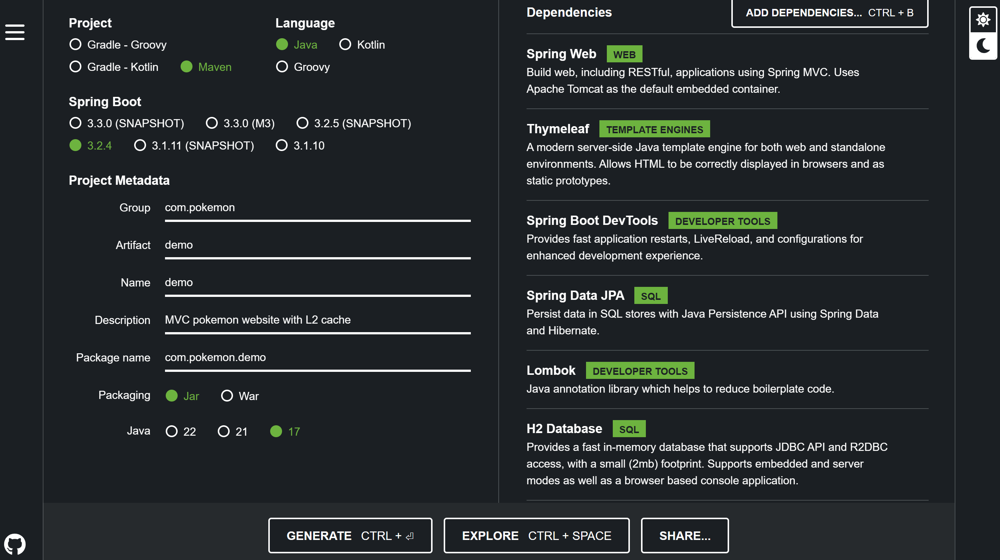

# Principios de Diseño - Programación Estructurada

## Instrucciones

Implementar una aplicación en SpringBoot, con JPA y conexión a base de datos H2.

La aplicación debe escribir registros en la base de datos y también acceder para leer los registros. Al leer se debe almacenar en caché. A partir de ahí los datos de ese registro los devolverá desde el caché, sin necesidad de acceder a la base.

Presentar en una diapositiva: Caché en memoria y Redis.

## Integrantes

- David Guamán
- Mateo Jaramillo
- David Naverrete
- Christian Jácome

## Recursos

- [Spring Boot](https://start.spring.io/)
- [Docker](https://www.docker.com/products/docker-desktop/)
- [Imágen de redis en Docker](https://hub.docker.com/_/redis)

## Spring Boot

### Módulos necesarios

- Spring Web
- Thymeleaf
- Spring Boot DevTools
- Spring Data JPA
- Lombok
- H2 Database

> [!Note]
> Los módulos ya se encuemtran instalados en el proyecto.



## Redis

### Instalación de redis:

``` cli
> docker pull redis
> docker docker run --name redisDemo -p 6379:6379 -d redis
```

### Terminal:

```cli
> docker exec -it redisDemo redis-cli
```

### Comandos:

``` cli
> PING
> KEYS *
> FLUSHALL
```
